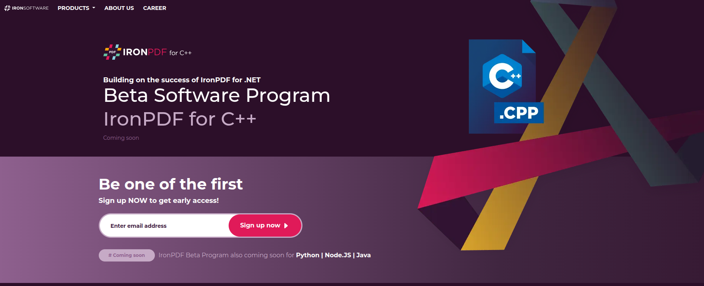
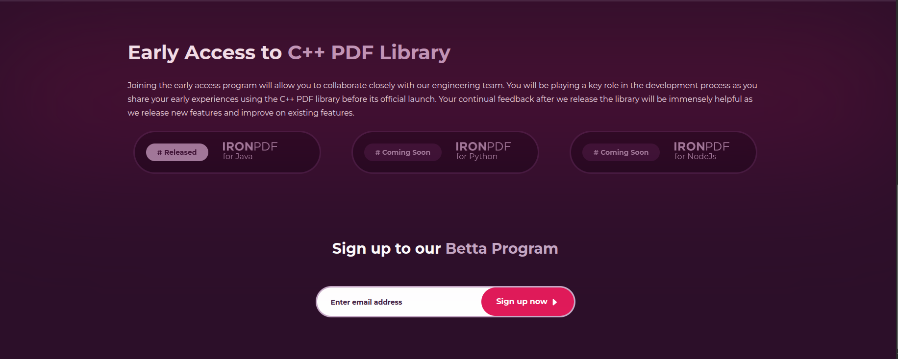

# IronPDF C++ Landing Page – CodeIgniter 4

## Overview

This project is a responsive landing page built with **CodeIgniter 4** as part of a technical assessment.  
The goal was to demonstrate:

- Clean MVC structure
- Routing and data passing
- JSON-driven dynamic content
- Semantic HTML
- Performance optimization (Core Web Vitals)
- Basic SEO and accessibility best practices

The page renders dynamic content (e.g., Early Access releases) from a local JSON file to simulate a real data source.

---

## Tech Stack

- **PHP 8+**
- **CodeIgniter 4**
- **Bootstrap 5**
- HTML5 (Semantic Markup)
- CSS3
- JSON (simulated data source)

---


### Key Implementation Details

- **Routing:** Defined in `app/Config/Routes.php`
- **Controller:** `Home.php` loads and parses JSON data
- **Data Source:** `app/Data/content.json`
- **View Rendering:** Data passed from controller to view
- **Dynamic Classes:** Release badges change based on status (`Released`, `Coming Soon`)
- **SEO:** Proper `<title>`, meta description, semantic headings
- **Accessibility:** Alt attributes, logical heading order, keyboard-friendly layout
- **Performance:**
  - Image dimensions defined to reduce CLS
  - Lazy loading for non-critical images
  - Caching headers configured for production
  - Reduced render-blocking resources
  - Optimized image sizes

---

## JSON Data Example

```json
{
  "earlyAccess": [
    {
      "status": "Released",
      "language": "Java",
      "image": "images/Ilustration/IronPdf-vector.png"
    },
    {
      "status": "Coming Soon",
      "language": "Python",
      "image": "images/Ilustration/IronPdf-vector.png"
    }
  ]
}
```

## How It Works

Routes are defined in `app/Config/Routes.php`

The Home controller loads data from `app/Data/home.json`

That data is passed to the view and rendered dynamically

Badge styles change based on release status (e.g., "Released" vs "Coming Soon")

### Install dependencies
```bash
composer install
```

## Update configuration

```
Open: app/Config/App.php

Set:

public string $baseURL = 'http://localhost:8080/';
public string $indexPage = '';

Run the project

Using CodeIgniter built-in server:

php spark serve


Or run with Apache (recommended).

Open in browser
http://localhost:8080
```


### Key Implementation Details

- **Routing:** Defined in `app/Config/Routes.php`
- **Controller:** `Home.php` loads and parses JSON data
- **Data Source:** `app/Data/content.json`
- **View Rendering:** Data passed from controller to view
- **Dynamic Classes:** Release badges change based on status (`Released`, `Coming Soon`)
- **SEO:** Proper `<title>`, meta description, semantic headings
- **Accessibility:** Alt attributes, logical heading order, keyboard-friendly layout
- **Performance:**
  - Image dimensions defined to reduce CLS
  - Lazy loading for non-critical images
  - Caching headers configured for production
  - Reduced render-blocking resources
  - Optimized image sizes

---

## JSON Data Example

```json
{
  "earlyAccess": [
    {
      "status": "Released",
      "language": "Java",
      "image": "images/Ilustration/IronPdf-vector.png"
    },
    {
      "status": "Coming Soon",
      "language": "Python",
      "image": "images/Ilustration/IronPdf-vector.png"
    }
  ]
}
```

---

## Run
```cp .env.example .env
composer install
php spark serve
```

## Demo Screenshots


